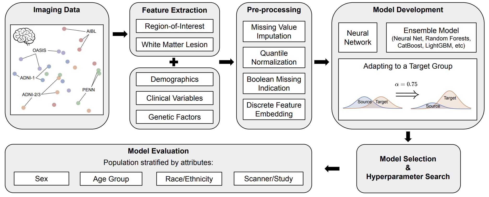

## Weighted-ERM: Adapting Machine Learning Diagnostic Models to New Populations Using a Small Amount of Data

<p align="center">
  
</p>

This is a PyTorch implementation of the [Weighted-ERM paper](https://arxiv.org/abs/2308.03175):
```
@article{wang2023adapting,
  title={Adapting Machine Learning Diagnostic Models to New Populations Using a Small Amount of Data: Results from Clinical Neuroscience},
  author={Wang, Rongguang and Erus, Guray and Chaudhari, Pratik and Davatzikos, Christos},
  journal={arXiv preprint arXiv:2308.03175},
  year={2023}
}
```

### Installation

```
git clone https://github.com/rongguangw/weightedERM.git
pip install -r weightedERM/requirements.txt
```

### Getting started

A simple usage of our Weighted-ERM interface is:

```python
import pandas as pd
from sklearn.model_selection import train_test_split

from weightedERM.models import WeightedERM

# load in data
data = pd.read_csv('weightedERM/datasets/neurosynth_subset.csv')
# remove irrelavant columns (participant id)
drop_cols = ['PTID']
data = data.drop(columns=drop_cols)
# prepare source and target data
# here we use female as source data and male as target data
source_data = data[data.Sex == 'F'].copy()
target_data = data[data.Sex == 'M'].copy()
# split train and test data
# for target data, we use 20% as train data and 80% as test data
source_train, source_test = train_test_split(source_data, test_size=0.2, random_state=42)
target_train, target_test = train_test_split(target_data, test_size=0.8, random_state=42)

# train on source data only, and test on target data
model = WeightedERM(label_name='Race', task_type='multiclass', metric='accuracy')
model.fit(source_train)

# evaluate the performance on test set
y_pred, y_prob = model.predict(source_test, with_prob=True)
model.eval(y_prob, source_test.Race)
```

By introducing a small amount of target data, Weighted-ERM can boost the performance:
```python
# train on source data and a small amount of target data, and test on target data
model = WeightedERM(label_name='Race', task_type='multiclass', metric='accuracy')
model.fit(source_data, target_train)

# evaluate the performance on test set
y_pred, y_prob = model.predict(target_test, with_prob=True)
model.eval(y_prob, target_test.Race)
```

### Weighted-ERM Usage

Here, we list some tips and tricks that might help you understand how to use it best.

- The sample dataset `neurosynth_subset.csv` we provided is a subset of NeuroSynth which is a dataset consists of 18,000 synthetic neuroimaging data samples covering worldwide healthy population across human lifespan. To access the entire dataset, please check https://huggingface.co/spaces/rongguangw/neuro-synth.
- Do not preprocess inputs to Weighted-ERM. Weighted-ERM pre-processes inputs internally.
- Weighted-ERM can be used for both `classification` and `regression` tasks. Modify `task_type` to change for different mode.
- We provide multiple `evaluation metric` for different tasks and you can specify it by using argument `metric`. Please check `examples` directory for sample `classification` and `regression` cases.
- Depending on resources tolerance, the training time can be specified using `time_limit` with unit second. In general, longer time produces better results.
- Saved `model parameter` directory will be shown after finished training. Model names can be specified using argument `model_name`.

### License

This project is under the CC-BY-NC 4.0 license. See [LICENSE](LICENSE) for details.
